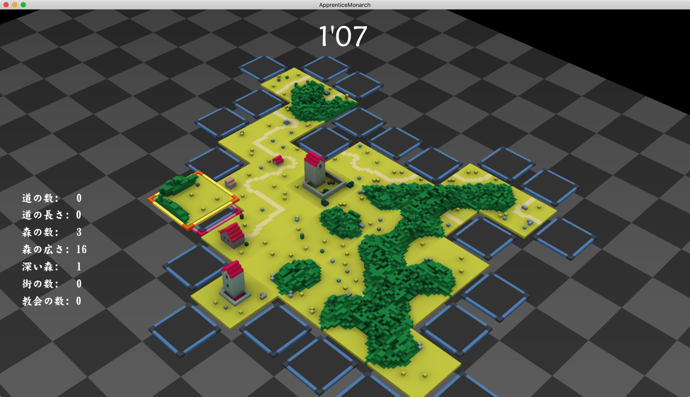

# Apprentice Monarch 見習い君主 試作版

## 概要
2018年年明けひとりゲームジャム作品

+ ボードゲーム「カルカソンヌ」を参考にしました
+ ３分でどれだけ領土を拡大できるかを競う
+ 右クリックでパネルを回し、左クリックで場に置く

## How to build

+ [Cinder 0.8.6](https://libcinder.org) が必要です。
+ Windows版はさらに boost 1.64.0 とともに cinder0.8.6 を x64 でビルドする必要があります。

## 利用した外部ライブラリ
+ Cinder 0.8.6
+ glm 0.9.8.4

## License
License All source code files are licensed under the MPLv2.0 license

[MPLv2.0](https://www.mozilla.org/MPL/2.0/)
